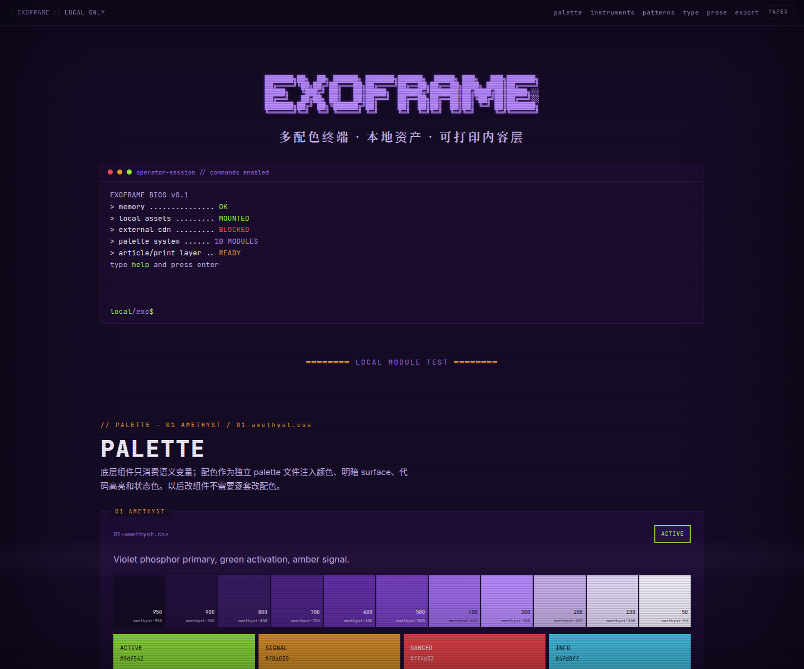

# dashen_ui_kit

`dashen_ui_kit` 是一个本地化、可复用、炫酷优先的前端 UI 组件库草案。当前视觉方向叫 EXOFRAME：终端、CRT、ASCII、仪表面板、强配色、文章排版、代码高亮、动效、打印/PDF 和未来 Codex skill 都在同一个系统里。



EXOFRAME 是原创视觉语言，不使用第三方影视、游戏、组织、角色、标志或复制界面资产。

## 核心原则

- 不使用 CDN。字体、Prism、GSAP 和运行时代码都走本地依赖。
- 组件底层和配色层分离。组件只消费 `--color-*`、`--code-*`、`--syntax-*` 等语义变量。
- 每套配色都是独立文件：`src/styles/tokens/palettes/*.css`。
- 新增配色只新增 palette 文件和 `src/data/palettes.ts` 清单，不改组件。
- 文章排版、打印/PDF 和 PPT 输出是一等模块，不是展示页附属品。
- `skill/` 目录保留未来封装成 Codex skill 的最小资源。
- ASCII 字标、图案和终端艺术必须等宽，不允许靠肉眼赌对齐。

## 快速开始

```bash
bun install
bun run dev
bun run check
```

浏览器入口是 Vite 输出的本地地址，默认 `http://127.0.0.1:5173/`。

## 常用命令

```bash
bun run dev
bun run check:types
bun run check:ascii
bun run check:local-assets
bun run build
bun run check
```

- `check:types`：运行 TypeScript 类型检查。
- `check:ascii`：检查 ASCII/方块字标等宽、无 tab、无尾随空格。
- `check:local-assets`：拒绝 CDN、Google Fonts、unpkg、jsDelivr 等远程运行时引用。
- `build`：生成 Vite 生产构建。
- `check`：按顺序执行类型、ASCII、本地资产和构建检查。

## 目录

- `src/styles/tokens/base/`：稳定基础 token。
- `src/styles/tokens/palettes/`：独立配色模块。
- `src/styles/tokens/palette-system.css`：把 active palette 映射到语义变量。
- `src/styles/tokens/semantic.css`：项目语义层。
- `src/styles/elements/`：原生 HTML、文章、代码和内容格式。
- `src/styles/components/`：可复用组件外壳。
- `src/styles/motion/`：动效基础。
- `src/styles/print/`：打印和 PDF 输出。
- `src/data/palettes.ts`：配色清单和展示数据。
- `src/lib/`：本地交互逻辑。
- `docs/DEVLOG.md`：开发步骤记录。
- `skill/`：未来 skill 草案。

## 使用方式

### 在展示页使用

1. 运行 `bun run dev`。
2. 打开 `http://127.0.0.1:5173/`。
3. 用页面里的 palette 控件切换配色。
4. 用右上角 `PAPER` 切换屏幕/纸面主题。
5. 用终端输入 `help`、`palette` 等命令检查本地交互。

### 在其他前端项目使用

按这个顺序迁移模块：

```text
tokens/base
tokens/palettes/one-active-palette.css
tokens/palette-system.css
tokens/semantic.css
elements or components
motion
print
```

组件只允许依赖语义变量，例如 `--color-primary`、`--color-card`、`--code-bg`、`--syntax-keyword`。不要在组件里写 `amethyst`、`azure` 这类具体配色名。

### 切换配色和主题

```html
<html data-theme="void" data-palette="amethyst"></html>
```

- `data-theme="void"`：深色终端界面。
- `data-theme="paper"`：浅色阅读和打印界面。
- `data-palette="amethyst"`：启用一套独立 palette。

## 配色

当前内置 10 套 palette：

- `01-amethyst.css`：紫磷主视觉，绿色激活，琥珀警示。
- `02-azure.css`：冷蓝仪表，青色激活。
- `03-scarlet.css`：红色战术壳，橙色信号。
- `04-obsidian.css`：黑色框架，酸性激活。
- `05-argent.css`：银灰工具界面。
- `06-osseous.css`：骨白纸面和矿物蓝。
- `07-amber.css`：经典琥珀终端。
- `08-phosphor.css`：绿磷终端。
- `09-hazard.css`：黄黑警示。
- `10-monochrome.css`：黑白极简。

## 新增一套配色

1. 在 `src/data/palettes.ts` 增加配色元数据、色阶和状态色。
2. 新增 `src/styles/tokens/palettes/NN-name.css`。
3. 在 `src/styles/main.css` 引入新 palette 文件。
4. 只提供 `--palette-*` 变量，不在组件里写具体颜色。
5. 运行 `bun run check` 和浏览器切换验证。

## Skill 使用

`skill/` 是未来可迁移到 Codex skills 的最小版本：

- `skill/SKILL.md`：EXOFRAME skill 主说明。
- `skill/references/design-rules.md`：视觉和命名规则。
- `skill/references/module-map.md`：模块迁移顺序。
- `skill/references/ppt-workflow.md`：用这套 UI 做 PowerPoint 的流程。
- `skill/assets/showcase-template/`：本地化展示模板。

当用户要求“用这套 UI 做 PPT/演示稿/报告 deck”时，skill 会要求读取 `ppt-workflow.md`，并通过 Presentations skill 与 `@oai/artifact-tool` 生成 `.pptx`。不得用 CDN、不得用 `python-pptx`，并且最终必须渲染检查重叠、裁切、换行和 ASCII 对齐。

## ASCII 检查

ASCII 相关内容使用 `bun run check:ascii` 验证。规则：

- `pre.ascii-wordmark` 每一行必须显示宽度一致。
- 带方块、边框或线条符号的 `text`/`txt`/`ascii` fenced block 必须显示宽度一致。
- 不允许 tab。
- 不允许尾随空格。

## 本地化策略

`scripts/check-local-assets.mjs` 会扫描远程运行时引用。出现 `https://`、cdnjs、Google Fonts、unpkg、jsDelivr 等远程依赖时会失败。文档里的本地图片路径可以使用，例如 `docs/assets/showcase-amethyst.png`。

## 更新记录

- `2026-06-22`：读取 Claude 对话并确认方向，创建本地化 Vite 项目，替换远程字体和 CDN Prism，加入本地字体、Prism、GSAP、TypeScript、Vite。
- `v0.1 Baseline Push`：加入数据驱动 palette gallery、组件、文章元素、GSAP 动效入口、打印/PDF 文档、架构文档和 skill 草案。
- `Independent Palette System`：把基础层、组件层和配色层拆开，新增 10 套独立 palette，加入 `palette-system.css` 作为映射层。
- `Docs And Skill Polish`：补充 README 截图、完整使用说明、PPT 工作流、ASCII 自动检查、本地资产扫描范围和验证命令。
